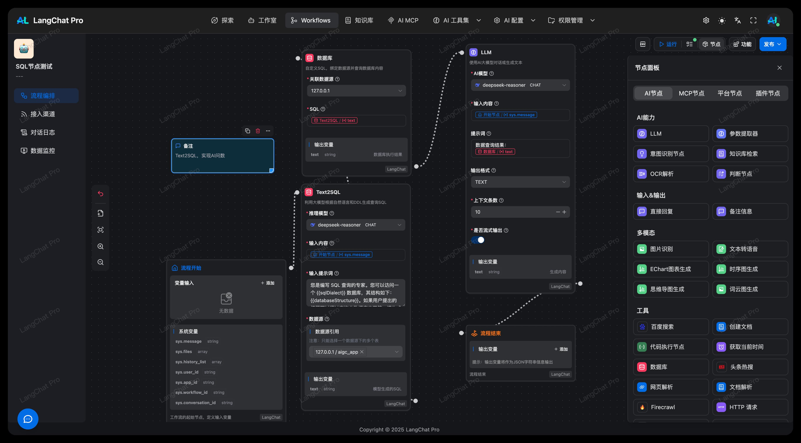

# LangChat Slides - 新一代 AI 幻灯片生成器

<div align="center">

**LangChat Slides** 是一款基于生成式 AI 的智能幻灯片生成工具，由 LangChat 团队开发。


[](LICENSE)

[官网](https://www.langchat.cn) · [在线预览](https://slides.langchat.cn) · [文档](docs) · [GitHub](https://github.com/langchat) · [报告问题](mailto:langchat@outlook.com)

**[English README](README.md)** | **[🇨🇳 中文文档](README_CN.md)**

</div>

---

## 📖 关于 LangChat Pro

**LangChat Pro** 是一个企业级 AIGC（AI Generated Content）平台，基于 Spring Boot 3 + LangChain4j + Vue3 + VueFlow 开发的全栈 AI 应用系统。

**LangChat Slides** 是 LangChat Pro 的旗舰产品之一，利用 LangChat 的强大模型能力与 `@antv/infographic` 的可视化引擎，用户只需输入自然语言描述，即可实时生成结构清晰、设计精美的信息图幻灯片。

---

### 💎 关于 LangChat Pro 商业版

**LangChat Pro** 是基于 Java 生态构建的**企业级 AIGC 应用开发平台商业版**，为企业提供完整的 AI 大模型集成解决方案。基于 Spring Boot 3 和 Vue 3 构建，支持快速构建智能知识库、多模态 AI 应用和智能工作流，助力企业实现 AI 驱动的数字化转型。

**产品官网**: http://langchat.cn/

**开源版地址**: https://github.com/tycoding/langchat (基础功能体验)

**商业版咨询**: 添加微信 **LangchainChat** (备注:公司名称 + [具体咨询内容])



## ✨ 核心特性

- ⚡️ **实时流式生成**：所见即所得，AI 思考的同时，幻灯片即刻渲染
- 🎨 **智能布局设计**：基于声明式可视化语法，自动适配最佳排版，告别繁琐的 PPT 拖拽
- 💬 **对话式修改**：不满意？直接告诉 AI "把标题改成红色" 或 "增加一个时间节点"，立刻生效
- 🧩 **模块化组件**：基于 Shadcn UI 与 Tailwind CSS，界面现代、简约、极致体验
- 📤 **便捷导出**：支持一键导出 PDF，轻松分享您的创意

## 🎯 适用场景

- **快速汇报**：几分钟内生成项目进度汇报页
- **知识科普**：将复杂的概念转化为时间轴、列表或层级图
- **数据展示**：结构化数据的可视化呈现

## 🛠️ 技术栈

### 前端技术
- **框架**：Vue 3 (Composition API) + TypeScript
- **样式**：Tailwind CSS v4, shadcn-vue (UI 组件库)
- **状态管理**：Pinia
- **图标**：Lucide Vue Next
- **可视化**：`@antv/infographic`
- **导出**：`html2canvas` + `jspdf`

### AI 集成
- **OpenAI SDK**：前端直接集成，支持流式响应
- **Vercel AI SDK**：辅助工具（可选）

### 开发工具
- **构建工具**：Vite 7
- **包管理器**：pnpm
- **代码质量**：TypeScript 严格模式，ESLint

## 📁 项目结构

```
langchat-slides/
├── docs/                    # 文档目录
│   ├── PRODUCT.md           # 产品介绍
│   └── REQUIREMENTS.md      # 需求与实施方案
├── public/                  # 静态资源
├── src/
│   ├── api/                 # API 集成
│   │   └── ai.ts           # OpenAI API 封装
│   ├── assets/
│   │   └── prompts/        # 系统提示词
│   ├── components/
│   │   ├── chat/           # 聊天组件
│   │   ├── slides/         # 幻灯片组件
│   │   ├── layout/         # 布局组件
│   │   └── ui/             # UI 组件 (shadcn-vue)
│   ├── composables/        # Vue 组合式函数
│   ├── lib/                # 工具函数
│   ├── locales/            # 国际化翻译
│   ├── stores/             # Pinia 状态管理
│   └── types/              # TypeScript 类型定义
├── Dockerfile              # Docker 配置
├── docker-compose.yml      # Docker Compose 配置
├── package.json
└── vite.config.ts
```

## 🚀 快速开始

### 环境要求

- Node.js >= 20.x
- pnpm >= 8.x
- OpenAI API Key

### 本地开发

1. **克隆仓库**
   ```bash
   git clone https://github.com/langchat/langchat-slides.git
   cd langchat-slides
   ```

2. **安装依赖**
   ```bash
   pnpm install
   ```

3. **配置环境变量**
   ```bash
   cp .env.example .env
   # 编辑 .env 文件，添加你的 OpenAI API Key
   ```

4. **启动开发服务器**
   ```bash
   pnpm dev
   ```

   访问 `http://localhost:5173`

5. **构建生产版本**
   ```bash
   pnpm build
   ```

## 🐳 Docker 部署

### 使用 Docker Compose（推荐）

1. **克隆仓库**
   ```bash
   git clone https://github.com/langchat/langchat-slides.git
   cd langchat-slides
   ```

2. **配置环境变量**
   ```bash
   cp .env.example .env
   # 编辑 .env 文件，添加你的 OpenAI API Key
   ```

3. **构建 Docker 镜像**
   ```bash
   docker-compose build
   ```

4. **使用 Docker Compose 启动**
   ```bash
   docker-compose up -d
   ```

   应用将在 `http://localhost:5173` 上提供服务

5. **查看日志**
   ```bash
   docker-compose logs -f
   ```

6. **停止服务**
   ```bash
   docker-compose down
   ```

### 直接使用 Docker

1. **构建 Docker 镜像**
   ```bash
   docker build -t langchat-slides .
   ```

2. **运行容器**
   ```bash
   docker run -d \
     --name langchat-slides \
     -p 5173:5173 \
     -e VITE_OPENAI_API_KEY=your-api-key \
     langchat-slides
   ```

## 🌐 环境变量配置

在项目根目录创建 `.env` 文件：

```env
# OpenAI 配置
VITE_OPENAI_API_KEY=sk-your-api-key-here
VITE_OPENAI_MODEL=gpt-4o

# 应用配置
VITE_APP_LOCALE=zh
VITE_APP_THEME=auto
```

## 📖 使用指南

### 创建幻灯片

1. **描述你的需求**：用自然语言输入幻灯片需求
   - 示例："创建一个展示 1950 年到 2024 年 AI 发展历史的时间轴"

2. **实时生成**：看着 AI 实时生成并渲染幻灯片

3. **迭代优化**：通过与 AI 对话进行调整
   - "把主题颜色改成蓝色"
   - "增加更多关于机器学习的细节"
   - "把时间轴改成横向"

4. **导出**：点击导出按钮下载为 PDF

### 功能特性

- **多页幻灯片**：生成多张幻灯片，支持缩略图导航
- **自定义调整**：通过对话修改布局、颜色和内容
- **导出选项**：支持导出为 PDF 或图片格式
- **主题支持**：支持浅色/深色模式，多种颜色主题

## 🏗️ 技术架构

### 组件架构

```
App.vue (主布局)
├── Header
│   ├── Logo
│   ├── 主题切换
│   └── 语言切换
├── ResizablePanelGroup
│   ├── 聊天区域
│   │   ├── ChatContainer
│   │   │   ├── ChatMessage (用户/AI)
│   │   │   └── ChatInput
│   │   └── ExampleGenerator
│   └── 幻灯片区域
│       ├── SlidesContainer
│       │   ├── SlidePreview
│       │   └── SlideThumbnail
│       └── SlideToolbar
└── SettingsDialog
```

### 数据流

```
用户输入 → ChatInput → OpenAI API (流式)
              ↓
         解析 Markdown
              ↓
         提取 Infographic 语法
              ↓
         更新 Pinia Store
              ↓
         SlidePreview 响应式渲染
              ↓
         导出 (html2canvas → jspdf)
```

## 🤝 贡献指南

我们欢迎贡献！请随时提交 Pull Request。

1. Fork 本仓库
2. 创建特性分支 (`git checkout -b feature/AmazingFeature`)
3. 提交更改 (`git commit -m 'Add some AmazingFeature'`)
4. 推送到分支 (`git push origin feature/AmazingFeature`)
5. 开启 Pull Request

## 📝 许可证

本项目采用 Apache License 2.0 许可证 - 详情请参见 [LICENSE](LICENSE) 文件。

## 📧 联系我们

- **官网**：https://www.langchat.cn
- **邮箱**：langchat@outlook.com
- **团队**：LangChat Team

## 🙏 致谢

- [OpenAI](https://openai.com/) - 提供强大的 AI 模型
- [AntV](https://antv.vision/) - 信息图可视化引擎
- [Vue.js](https://vuejs.org/) - 响应式框架
- [Shadcn](https://ui.shadcn.com/) - 精美的 UI 组件
- [Tailwind CSS](https://tailwindcss.com/) - 实用优先的样式框架

---

**由 LangChat Team 用 ❤️ 开发**
